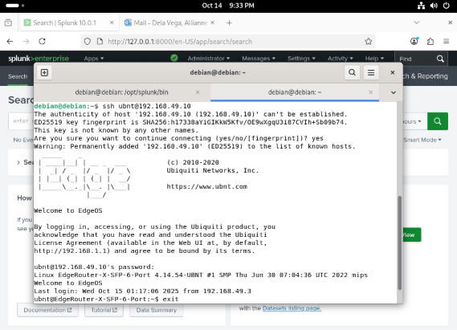
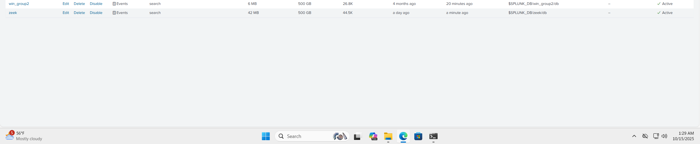
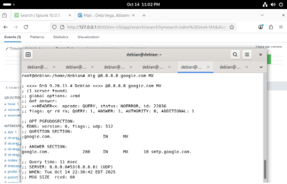
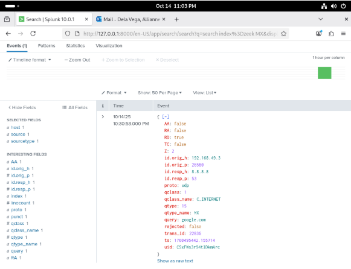

# Network Monitoring with Zeek & Splunk SIEM  
**Configured a Zeek sensor to capture SSH and DNS traffic, forward JSON-formatted logs to Splunk, and analyze endpoint-to-network interactions across a multi-host environment.**

**Tools & Technologies:** Zeek • Splunk Enterprise • Debian • SSH • DNS • JSON logs • Packet analysis • SPL queries

---

## 🧠 Overview

This project expands on my initial SIEM setup by integrating a dedicated **Zeek network sensor** into the environment. The objective was to monitor real network traffic (SSH, DNS), generate logs from intentional activity, and verify ingestion inside Splunk through the **Zeek JSON pipeline**.

This mirrors real SOC workflows where endpoint logs (via Windows Event Forwarders) are combined with **network-level telemetry** (via Zeek).

---

## 🖥️ 1. Network Architecture with Zeek Sensor

  

### ✔️ What This Shows  
This updated diagram includes a dedicated **Zeek Sensor (192.168.49.38)** connected to a mirrored switch port.  
It monitors:
- SSH traffic between internal hosts and the router  
- DNS queries to external resolvers  
- General east-west network movement  

**Why it matters:**  
Zeek provides deep network visibility. Combined with Splunk, this forms a full-stack monitoring ecosystem across **hosts + network traffic**.

---

## 🔐 2. SSH Traffic Generation

  

### ✔️ What This Shows  
This screenshot captures the SSH session used to intentionally generate network traffic:
ssh ubnt@192.168.49.10

It includes:
- Key fingerprint prompt  
- Successful login to the EdgeOS router  
- Command execution (`exit`)  
- A visible connection source: 192.168.49.3  

**Why it matters:**  
Zeek detects SSH traffic automatically. By generating a legitimate session, I created identifiable logs to test ingestion and SSH protocol parsing.

---

## 📁 3. Splunk Index Validation

  

### ✔️ What This Shows  
The **zeek** index is active and receiving data, alongside the existing Windows logs index (`win_group2`).  
This confirms:
- The Splunk receiver port is working  
- Zeek logs are being forwarded continuously  
- The pipeline is stable  

**Why it matters:**  
If the index shows new events, the data pipeline is functional.

---

## 🌐 4. DNS Query Generation

  

### ✔️ What This Shows  
Using the Linux `dig` utility, I generated DNS traffic:
dig @8.8.8.8 google.com MX

This forces:
- A DNS request to Google DNS (8.8.8.8)  
- An MX record lookup (mail exchanger records)  

**Why it matters:**  
DNS traffic is fundamental for detection use cases such as:
- Domain reputation checking  
- Beaconing detection  
- Suspicious DNS tunneling  

This traffic appears automatically in Zeek’s `dns.log`.

---

## 📊 5. Splunk Search — DNS Events from Zeek

  

### ✔️ What This Shows  
A Zeek-parsed DNS event inside Splunk, with fields extracted from `dns.log` including:

- `id.orig_h`: 192.168.49.3  
- `id.resp_h`: 8.8.8.8  
- `query`: "google.com"  
- `qtype_name`: "MX"  
- `rcode`: 0 (successful)  
- `proto`: udp  

**Why it matters:**  
This confirms Zeek correctly captured the DNS request and that Splunk properly parsed JSON logs into structured fields—exactly how SOC teams investigate suspicious domains.

---

## 🔐 6. Splunk Search — SSH Events from Zeek

  

### ✔️ What This Shows  
Parsed SSH connection logs from Zeek including:

- SSH client version (`OpenSSH_10.0p2`)  
- Auth attempts  
- Origin and responder IPs  
- Protocol and version identifiers  

Two relevant events appear:
1. **Telemetry** (general SSH metadata)  
2. **Connection log** (who connected to whom, using what client)  

**Why it matters:**  
This demonstrates:
- Zeek’s protocol-level understanding of SSH  
- Successful forwarding of Zeek JSON logs into Splunk  
- Ability to correlate host activity with network behavior  

This is a core skill in incident response.

---

## 🛠️ Skills Demonstrated

- Zeek installation & sensor configuration  
- Network mirroring (SPAN port monitoring)  
- SSH and DNS traffic analysis  
- JSON log parsing within Splunk  
- SPL query design  
- Correlating endpoint + network telemetry  
- Building real-world defensive monitoring pipelines  

---

## 📁 Project Structure
Network-Monitoring-Zeek/
│── README.md
│── screenshots/
│ ├── cns-lab7diag.jpg
│ ├── ssh_ubnt.png
│ ├── Splunk_Index.png
│ ├── dns-traffic.png
│ ├── dig_google.png
│ └── search_JSON.png

---

## 🏁 Summary

This project demonstrates the integration of **network-level visibility (Zeek)** with **host-level telemetry (Windows logs)** inside a unified Splunk SIEM environment.  
It replicates a realistic SOC monitoring scenario and showcases my ability to configure sensors, generate traffic, parse logs, and analyze security-relevant data end-to-end.
