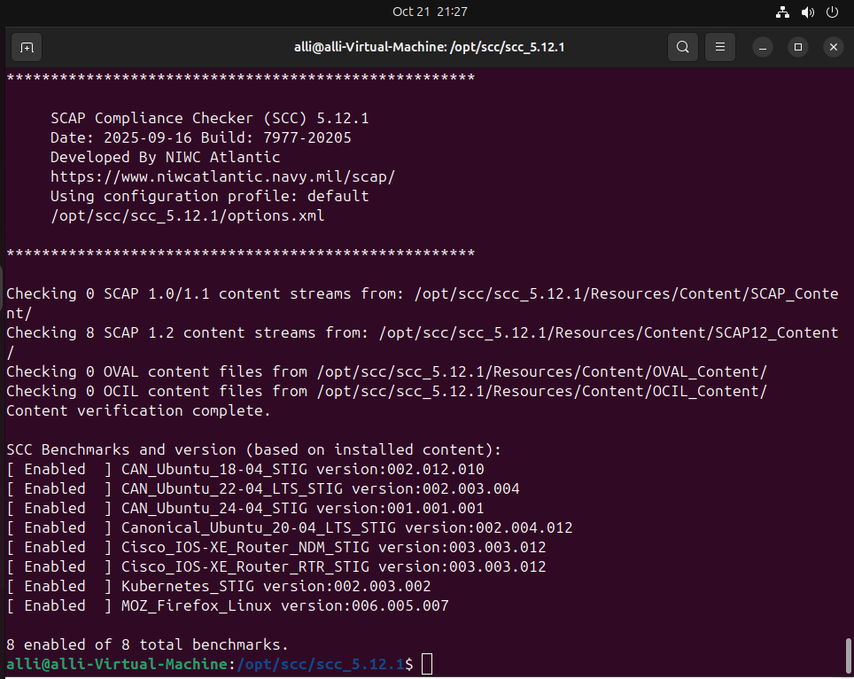
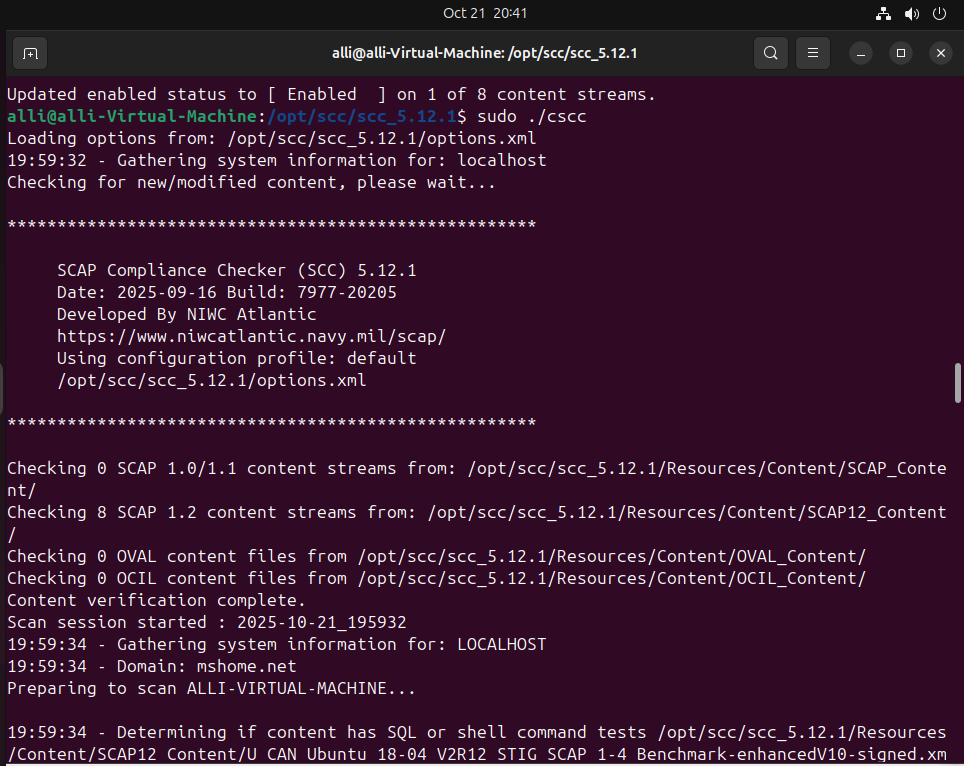
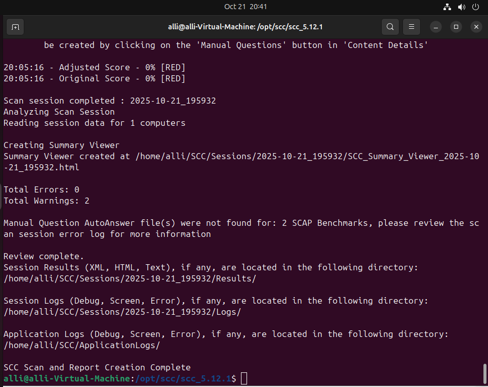
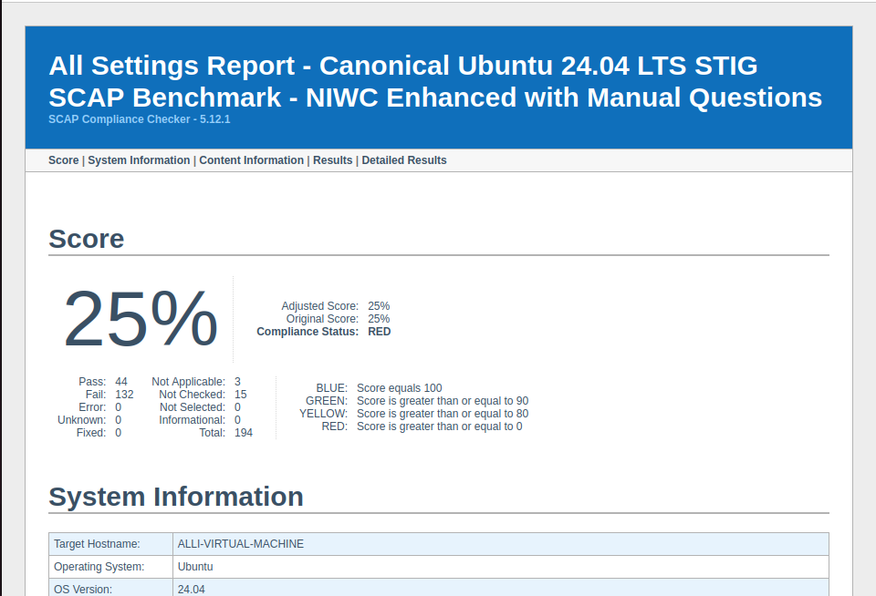

# SCAP Compliance Checker (SCC) — Hardening Assessment

One-line: Performed a DISA STIG–based vulnerability and compliance assessment on Ubuntu 24.04 LTS using SCAP Compliance Checker (SCC) 5.12.1.

Tools & Technologies: SCAP Compliance Checker (SCC), DISA STIG Benchmarks, Ubuntu 24.04 LTS, OVAL/OCIL/SCAP 1.2

---

## Overview

This project evaluates the security posture of a newly installed Ubuntu 24.04 LTS virtual machine using the SCAP Compliance Checker (SCC), a DoD-approved automated assessment tool that parses DISA STIG benchmarks and outputs system compliance scores.

Goals:
- Install and configure SCC
- Run the Canonical Ubuntu 24.04 STIG benchmark
- Analyze PASS / FAIL results and CAT I findings
- Demonstrate automated host-assessment workflows

This project mirrors real-world compliance operations performed by host hardening teams, cyber protection teams (CPTs), and vulnerability management divisions.

---

## Installation & Benchmark Detection

<p align="center">
  
</p>

This screenshot shows SCC 5.12.1 successfully installed under /opt/scc, with all available SCAP 1.2 content streams and benchmarks verified. Enabled benchmarks include:

- Canonical Ubuntu 18.04, 20.04, 24.04 STIG
- Kubernetes STIG
- Cisco IOS XE Router STIG
- Mozilla Firefox Linux STIG

Description: SCC 5.12.1 installed under /opt/scc with SCAP 1.2 content streams. Enabled benchmarks included Canonical Ubuntu (18.04, 20.04, 24.04), Kubernetes, Cisco IOS XE, and Mozilla Firefox.

Learning Impact:
Understanding SCAP content and benchmark versions is essential for ensuring assessments align with the correct OS baseline.

---

## Running the Scan

<p align="center">
  
</p>

<p align="center">
  
</p>

Example commands used:

```bash
sudo ./cscc --disableAll
sudo ./cscc -eb Canonical_Ubuntu_24.04
sudo ./cscc -eb MOZ_Firefox_Linux
sudo ./cscc
```

During execution, SCC:
- Loads XML, OVAL, and OCIL content
- Gathers system information
- Executes 190+ automated checks
- Generates HTML/XML report bundles

This replicates the exact workflow used by DoD host hardening teams during cyber readiness inspections.

---

## Results (HTML Report)

<p align="center">
  
</p>

Key results:
- Overall score: 25% (RED)  
- PASS: 44 controls
- FAIL: 132 controls
- Not Checked: 15  
- CAT I Failures: 9 (highest severity)

Interpretation: A default Ubuntu install fails many STIG controls (SSH, password policies, file permissions, logging/auditing, kernel hardening). Results form the basis of a remediation plan.

---

## Artifacts Generated

SCC produced:
- HTML summary viewer  
- XML results  
- Text logs, debug logs, application logs  
- Session history directory

These artifacts align with formats expected by security teams and accreditation packages.

---

## Compliance Summary

| Category        | Count    |
|-----------------|----------|
| PASS            | 44       |
| FAIL            | 132      |
| Not Checked     | 15       |
| CAT I Failures  | 9        |
| Compliance Score| 25% (RED)|

A RED score indicates critical misconfigurations, missing controls, insufficient logging/auditing, and insecure defaults.

---

## Lessons Learned

- How enterprise and government organizations audit Linux hosts  
- How SCAP / OVAL / OCIL content drive automated scans  
- Interpreting DISA STIG outputs and prioritizing CAT I findings  
- Preparing machine-generated artifacts for reporting and remediation tracking

---

## Skills Demonstrated

- Automated host security assessment  
- DISA STIG benchmark interpretation  
- Linux hardening analysis and remediation planning  
- Vulnerability triage and prioritization  
- SCAP-compliant auditing workflows  
- Security documentation and reporting

---

## Project Structure

SCAP-Compliance-Assessment/  
├── README.md  
└── screenshots/  
    ├── benchmarks.png  
    ├── CAN_Ubuntu_settings.png  
    ├── scc_running1.png  
    └── scc_running2.png

---

Summary: 

This project demonstrates hands-on experience with DoD-grade auditing tools by applying STIG benchmarks to evaluate the hardened security posture of a Linux system.
Running SCC against Ubuntu 24.04 provided practical experience in automated compliance scanning, interpreting high-severity findings, and understanding the reporting expectations of enterprise security teams.

This entry showcases strong foundational skills in:

Linux host security

Compliance frameworks

Security automation

Vulnerability management

Perfect for cybersecurity engineering, SOC analyst, and cyber defense roles.