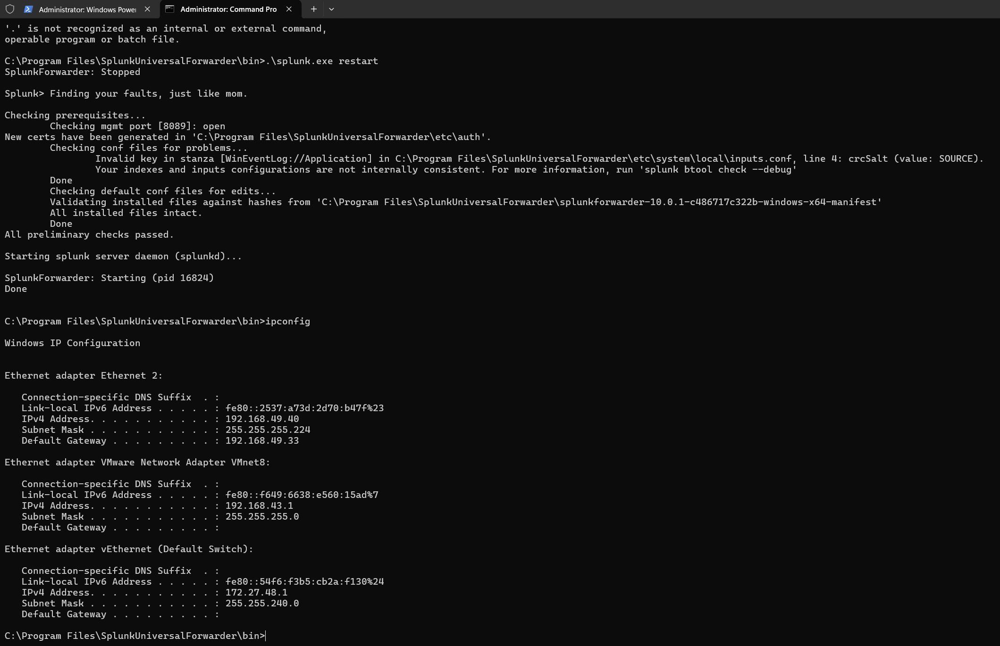
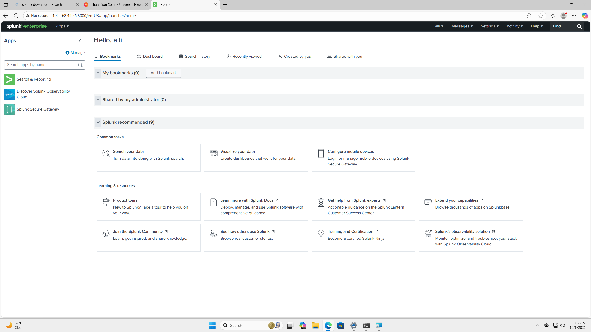

# Splunk & Windows Event Log Ingestion

**Designed and deployed a complete SIEM pipeline using Splunk Enterprise and Windows Universal Forwarders to aggregate, index, and analyze real-time Windows Event Logs across a multi-host lab environment.**

**Tools & Technologies:** Splunk Enterprise • Universal Forwarder • Windows Event Logs • Debian • Network Architecture • Log Indexing • SPL (Search Processing Language)

---

## 🧠 Overview

This project replicates a real enterprise SIEM environment. I deployed Splunk Enterprise on a Debian-based server, configured receiving ports, and installed Universal Forwarders on multiple Windows workstations to forward Security, Application, and System logs.

The end goal was to build an operational SIEM pipeline, validate event ingestion, and perform event triage similar to a SOC analyst.

---

## 🖥️ 1. Network Architecture

  

---

## 📸 Key Screenshots

### 🔹 Splunk Enterprise Web Interface  

  

### ✔️ What This Shows  
This PowerShell output verifies:

- The **Universal Forwarder service** is running  
- Config validation checks have passed  
- The client can communicate on the correct subnet  
- The host’s interfaces and IP addresses (via `ipconfig`)  

**Why it matters:**  
The Universal Forwarder is the endpoint sensor.  
A working forwarder = **endpoint logs are successfully being sent to the SIEM**, which is the foundation of host-level visibility.

---

## 🌐 3. Splunk Enterprise Web Interface

  

### ✔️ What This Shows  
This screenshot confirms:

- Successful deployment of Splunk Enterprise  
- The UI is reachable on the Debian host’s IP  
- Administrative access to build indexes, configure inputs, and analyze data  

**Why it matters:**  
The Splunk UI is central to operations: creating dashboards, querying logs, managing indexes, and monitoring ingestion.

---

## 🔎 4. Event Log Search & Analysis

  

### ✔️ What This Shows  
Using SPL:
index="win_group2" host=M234ws07

Splunk returns **live Windows Event Logs** forwarded from a domain workstation.

In this example, Splunk displays:

- **EventCode 16394**  
- Application-level logs  
- Timestamps aligned with host activity  
- Source: `WinEventLog:Application`  

**Why it matters:**  
This validates the **full SIEM pipeline**:

1. Windows generates event  
2. Universal Forwarder collects  
3. Forwarder transmits to Splunk  
4. Splunk indexes the event  
5. Analyst queries and interprets the data  

This is the exact workflow used in SOC environments to identify anomalies and security incidents.

---

## 📊 Findings

A sample ingested event:

- **EventCode:** 16394  
- **Meaning:** The "Software Protection Platform Service" has successfully started.  
- **Relevance:** Confirms that host application logs are correctly forwarded, indexed, and searchable.

This validates the SIEM pipeline end-to-end.

---

## Key Learning Outcomes
- Built practical SIEM ingestion workflows  
- Gained experience with Universal Forwarder configuration  
- Configured custom indexes and receiving ports  
- Performed Windows Event Log triage using Splunk Search  
- Strengthened understanding of enterprise log architecture and SOC workflows  

---