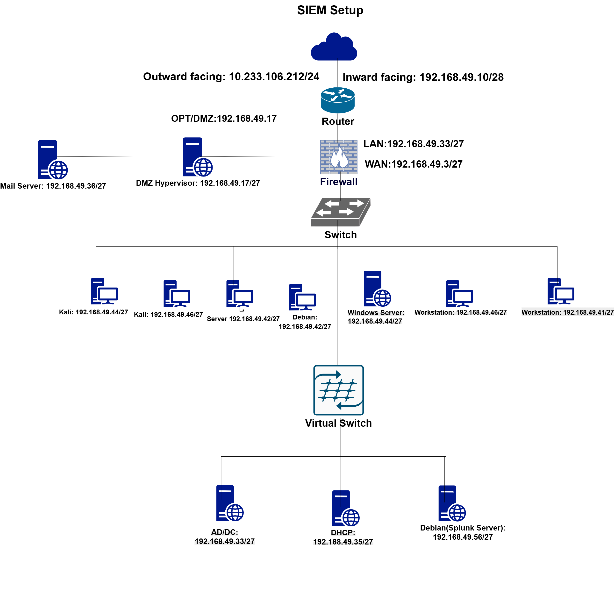
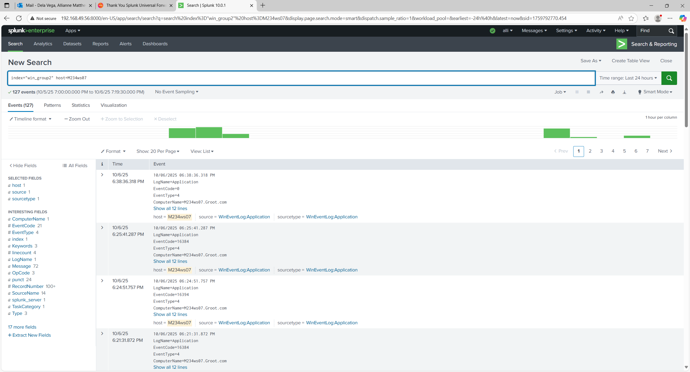

# Splunk SIEM Deployment & Windows Event Log Ingestion

**Designed and deployed a complete SIEM pipeline using Splunk Enterprise and Windows Universal Forwarders to aggregate, index, and analyze real-time Windows Event Logs across a multi-host lab environment.**

**Tools & Technologies:** Splunk Enterprise • Universal Forwarder • Windows Event Logs • Debian • Network Architecture • Log Indexing • SPL (Search Processing Language)

---

## 🧠 Overview

This project replicates a real enterprise SIEM environment. I deployed Splunk Enterprise on a Debian-based server, configured receiving ports, and installed Universal Forwarders on multiple Windows workstations to forward Security, Application, and System logs.

The end goal was to build an operational SIEM pipeline, validate event ingestion, and perform event triage similar to a SOC analyst.

---

## 🖥️ 1. Network Architecture

  

### ✔️ What This Shows  
This diagram represents the full SIEM lab environment, including:

- **Splunk Server (Debian, 192.168.49.56)**  
- **Windows workstations** configured with Universal Forwarders  
- **Active Directory Domain Controller**  
- **DHCP & Mail servers**  
- **Kali Linux hosts**  
- **DMZ and LAN segmentation**  

**Why it matters:**  
A proper SIEM deployment depends heavily on network segmentation and telemetry visibility. This architecture mirrors production environments used for enterprise security monitoring.

---

## 📥 2. Universal Forwarder Configuration

  

### ✔️ What This Shows  
This PowerShell output verifies:

- The **Universal Forwarder service** is running  
- Config validation checks have passed  
- The client can communicate on the correct subnet  
- The host’s interfaces and IP addresses (via `ipconfig`)  

**Why it matters:**  
The Universal Forwarder is the endpoint sensor.  
A working forwarder = **endpoint logs are successfully being sent to the SIEM**, which is the foundation of host-level visibility.

---

## 🌐 3. Splunk Enterprise Web Interface

  

### ✔️ What This Shows  
This screenshot confirms:

- Successful deployment of Splunk Enterprise  
- The UI is reachable on the Debian host’s IP  
- Administrative access to build indexes, configure inputs, and analyze data  

**Why it matters:**  
The Splunk UI is central to operations: creating dashboards, querying logs, managing indexes, and monitoring ingestion.

---

## 🔎 4. Event Log Search & Analysis

  

### ✔️ What This Shows  
Using SPL:
index="win_group2" host=M234ws07

Splunk returns **live Windows Event Logs** forwarded from a domain workstation.

In this example, Splunk displays:

- **EventCode 16394**  
- Application-level logs  
- Timestamps aligned with host activity  
- Source: `WinEventLog:Application`  

**Why it matters:**  
This validates the **full SIEM pipeline**:

1. Windows generates event  
2. Universal Forwarder collects  
3. Forwarder transmits to Splunk  
4. Splunk indexes the event  
5. Analyst queries and interprets the data  

This is the exact workflow used in SOC environments to identify anomalies and security incidents.

---

## 📊 Findings

A sample ingested event:

- **EventCode:** 16394  
- **Meaning:** Software Protection Platform Service started  
- **Category:** System Health  
- **Why it matters:** Confirms the SIEM is receiving operational, host-level telemetry necessary for monitoring service stability and detecting abnormal behavior.

---

## 🛠️ Skills Demonstrated

- SIEM deployment & configuration  
- Endpoint log forwarding  
- Windows Event Log analysis  
- Index creation & pipeline troubleshooting  
- SPL query development  
- Network architecture mapping  
- Real-time monitoring workflows  

---

## 📁 Project Structure
Splunk-SIEM-Deployment/
│── README.md
│── screenshots/
│ ├── Splunk-network-diagram.png
│ ├── Universal-Forwarder.png
│ ├── Splunk-UI.png
│ └── Event-search.png
│── configs/
│ └── inputs.conf

---

## 🏁 Summary

This project demonstrates my ability to deploy a functioning SIEM environment, forward logs from multiple Windows endpoints, build custom indexes, validate ingestion pipelines, and perform real-time event triage. It reflects the core competencies expected of SOC analysts, detection engineers, and cybersecurity practitioners.
